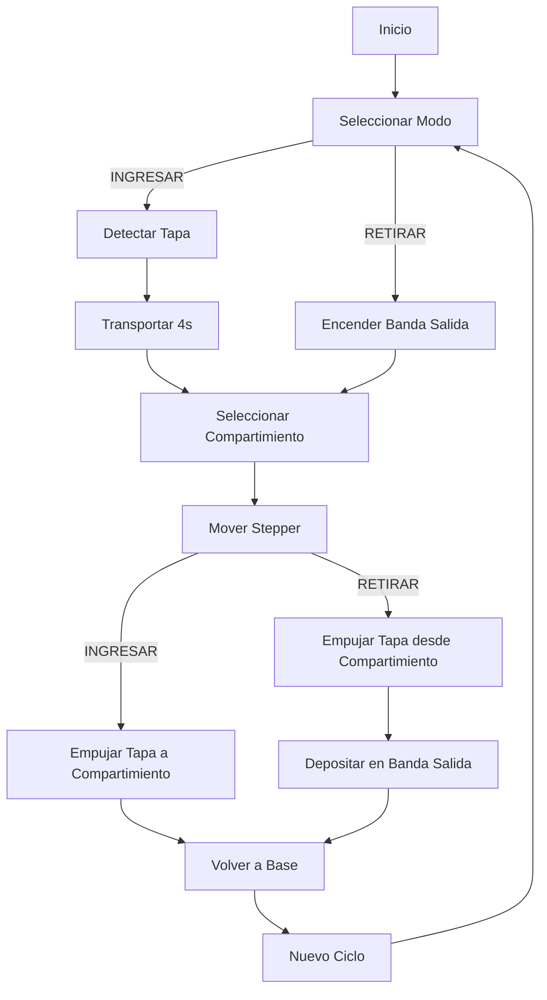

# 🏭 Sistema de Banda Transportadora con Compartimientos
## Automated Conveyor Belt Storage System

---

## 📋 Descripción General

Sistema automatizado de banda transportadora bidireccional para almacenamiento y recuperación de cajas/tapas en 4 compartimientos independientes. El sistema utiliza un ESP32 para controlar motores DC, un motor paso a paso (stepper), y múltiples servomotores, con interfaz gráfica de usuario (GUI) para operación remota vía comunicación serial.

### Características Principales
- ✅ **Modo INGRESAR**: Carga cajas desde banda de entrada → almacena en compartimientos
- ✅ **Modo RETIRAR**: Recupera cajas de compartimientos → deposita en banda de salida
- ✅ **4 Compartimientos** de almacenamiento independientes
- ✅ **Detección automática** de objetos mediante sensor ultrasónico
- ✅ **Control GUI** mediante Python/Tkinter
- ✅ **Comunicación Serial** bidireccional (ESP32 ↔ PC)

---

## 🎯 Flujo de Operación

### Modo INGRESAR (Carga)
```
┌─────────────────────────────────────────────────────────┐
│  1. Tapa detectada en banda de entrada (sensor HC-SR04) │
│  2. Motor DC de entrada transporta tapa (4 segundos)    │
│  3. Usuario selecciona compartimiento (1-4) en GUI      │
│  4. Motor stepper posiciona sistema en compartimiento   │
│  5. Servo empujador deposita tapa en compartimiento     │
│  6. Stepper regresa a posición base (0°)                │
│  7. Sistema listo para nuevo ciclo                      │
└─────────────────────────────────────────────────────────┘
```

### Modo RETIRAR (Descarga)
```
┌─────────────────────────────────────────────────────────┐
│  1. Motor DC de salida se enciende automáticamente      │
│  2. Usuario selecciona compartimiento (1-4) en GUI      │
│  3. Motor stepper posiciona sistema en compartimiento   │
│  4. Servo del compartimiento empuja tapa hacia fuera    │
│  5. Tapa cae y es recogida por el stepper              │
│  6. Stepper regresa a posición base (180°)              │
│  7. Servo principal empuja tapa a banda de salida      │
│  8. Motor de salida detiene tras 1 segundo             │
│  9. Sistema solicita nuevo modo de operación           │
└─────────────────────────────────────────────────────────┘
```

---

## 🔧 Hardware

### Componentes Principales

#### Microcontrolador
- **ESP32** (principal controlador)
  - Comunicación serial: 115200 baud
  - Puerto: COM3 (configurable)

#### Sensores
- **HC-SR04** (sensor ultrasónico)
  - TRIG1: GPIO 14
  - ECHO1: GPIO 12
  - Umbral detección: 10 cm

#### Motores DC (L298N Dual H-Bridge)
- **Motor Banda de Entrada** (Canal B)
  - IN3: GPIO 26
  - IN4: GPIO 27
  - ENB: GPIO 25 (PWM)
  - Velocidad: 200/255

- **Motor Banda de Salida** (Canal A)
  - IN1: GPIO 15
  - IN2: GPIO 2
  - ENA: GPIO 4 (PWM)
  - Velocidad: 200/255

#### Motor Paso a Paso
- **28BYJ-48** con driver **ULN2003**
  - IN1: GPIO 32
  - IN2: GPIO 33
  - IN3: GPIO 19
  - IN4: GPIO 23
  - Pasos por revolución: 2048
  - Velocidad: 12 RPM

#### Servomotores (5 unidades)
- **Servo Principal** (modo INGRESAR + empuje a banda)
  - Pin: GPIO 21
  - Rango: 0° (empuje) ↔ 180° (retraído)
  
- **Servo Compartimiento 1** (modo RETIRAR)
  - Pin: GPIO 16
  - Configuración: INVERTIDA (180° → 0°)
  
- **Servo Compartimiento 2** (modo RETIRAR)
  - Pin: GPIO 17
  - Configuración: NORMAL (0° → 180°)
  
- **Servo Compartimiento 3** (modo RETIRAR)
  - Pin: GPIO 22
  - Configuración: INVERTIDA (180° → 0°)
  
- **Servo Compartimiento 4** (modo RETIRAR)
  - Pin: GPIO 13
  - Configuración: NORMAL (0° → 180°)

### Diagrama de Conexiones

```
ESP32
├── HC-SR04 (Sensor Entrada)
│   ├── TRIG → GPIO 14
│   └── ECHO → GPIO 12
│
├── L298N (Control Motores DC)
│   ├── Canal A (Banda Salida)
│   │   ├── IN1 → GPIO 15
│   │   ├── IN2 → GPIO 2
│   │   └── ENA → GPIO 4 (PWM)
│   └── Canal B (Banda Entrada)
│       ├── IN3 → GPIO 26
│       ├── IN4 → GPIO 27
│       └── ENB → GPIO 25 (PWM)
│
├── ULN2003 (Motor Stepper)
│   ├── IN1 → GPIO 32
│   ├── IN2 → GPIO 33
│   ├── IN3 → GPIO 19
│   └── IN4 → GPIO 23
│
└── Servomotores
    ├── Servo Principal → GPIO 21
    ├── Servo Comp 1 → GPIO 16
    ├── Servo Comp 2 → GPIO 17
    ├── Servo Comp 3 → GPIO 22
    └── Servo Comp 4 → GPIO 13
```

---

## 💻 Software

### Estructura del Proyecto

```
banda-transportadora/
├── main.ino            # Código Arduino/ESP32
├── gui.py              # Interfaz gráfica Python
├── requirements.txt    # Dependencias Python
└── README.md          # Documentación
```

### Arquitectura del Sistema

#### 1. **main.ino** (ESP32 - Control Embebido)

**Máquina de Estados:**
```cpp
WAITING_MODE        → Espera selección de modo (INGRESAR/RETIRAR)
    ↓
IDLE                → Espera detección de tapa (solo INGRESAR)
    ↓
MOTOR_ON            → Banda de entrada activa (4s)
    ↓
WAIT_FOR_DESTINATION → Espera selección de compartimiento
    ↓
MOVING              → Stepper posiciona en compartimiento
    ↓
PUSHING             → Servo ejecuta empuje
    ↓
[Regreso a WAITING_MODE]
```

**Funciones Principales:**

| Función | Descripción |
|---------|-------------|
| `medirDistancia()` | Lee sensor ultrasónico HC-SR04 |
| `encenderMotorEntrada()` | Activa banda de entrada (PWM 200) |
| `detenerMotorEntrada()` | Detiene banda de entrada |
| `encenderMotorSalida()` | Activa banda de salida (PWM 200) |
| `detenerMotorSalida()` | Detiene banda de salida |
| `definirPosiciones()` | Calcula ángulos stepper por modo |
| `moverAPosicion(comp)` | Mueve stepper al compartimiento |
| `volverABase()` | Regresa stepper a 0° o 180° |
| `empujarTapa()` | Servo principal empuja (INGRESAR) |
| `empujarTapaRetirar(comp)` | Servo compartimiento empuja (RETIRAR) |

**Posiciones del Motor Stepper:**

| Modo | Base | Comp 1 | Comp 2 | Comp 3 | Comp 4 |
|------|------|--------|--------|--------|--------|
| INGRESAR | 0° | -125° | -55° | +71° | +121° |
| RETIRAR | 180° | +240° | +305° | +70° | +123° |

**Protocolo de Comunicación Serial:**

| Dirección | Comando | Descripción |
|-----------|---------|-------------|
| PC → ESP32 | `INGRESAR` | Seleccionar modo ingreso |
| PC → ESP32 | `RETIRAR` | Seleccionar modo retiro |
| PC → ESP32 | `1`, `2`, `3`, `4` | Seleccionar compartimiento |
| PC → ESP32 | `CONTINUE` | Continuar ciclo (no usado actualmente) |
| ESP32 → PC | `MODE_REQUEST` | Solicita selección de modo |
| ESP32 → PC | `MODE_CONFIRMED` | Modo confirmado |
| ESP32 → PC | `READY` | Sistema listo para recibir compartimiento |
| ESP32 → PC | `MOVE_DONE` | Movimiento completado |

#### 2. **gui.py** (Python - Interfaz de Usuario)

**Características:**
- **Framework**: Tkinter
- **Comunicación**: PySerial (115200 baud)
- **Threading**: Lectura serial asíncrona
- **Tamaño ventana**: 380x400px
- **Tema**: Oscuro (#222 background)

**Componentes GUI:**

```python
┌──────────────────────────────────────┐
│  Control de Compartimientos          │
│                                      │
│  ┌────────────────────────────────┐ │
│  │ Seleccioná el Modo de Operación│ │
│  │                                │ │
│  │  [  INGRESAR TAPA  ] (verde)  │ │
│  │  [  RETIRAR TAPA   ] (rojo)   │ │
│  └────────────────────────────────┘ │
│                                      │
│  ┌────────────────────────────────┐ │
│  │ Seleccioná Compartimiento      │ │
│  │                                │ │
│  │  [ Compartimiento 1 ]         │ │
│  │  [ Compartimiento 2 ]         │ │
│  │  [ Compartimiento 3 ]         │ │
│  │  [ Compartimiento 4 ]         │ │
│  │                                │ │
│  │  [ CONTINUAR (tapa colocada) ]│ │
│  └────────────────────────────────┘ │
│                                      │
│  [ Cambiar Modo ]                   │
│                                      │
│  Estado: READY - Seleccioná comp... │
└──────────────────────────────────────┘
```

**Variables Globales:**
```python
modo_seleccionado      # Modo actual (INGRESAR/RETIRAR)
modo_confirmado        # Bool: confirmación del ESP32
arduino                # Objeto serial.Serial
```

**Funciones Principales:**
```python
seleccionar_modo(modo)       # Envía INGRESAR/RETIRAR
enviar_comando(num)          # Envía compartimiento (1-4)
set_buttons_enabled(enabled) # Habilita/deshabilita botones
continuar_ciclo()            # Envía CONTINUE
volver_a_seleccion_modo()    # Reinicia flujo
serial_reader_thread()       # Lee mensajes del ESP32
```

---

## 🚀 Instalación y Configuración

### Requisitos Previos

#### Hardware
- ESP32 DevKit
- Sensor ultrasónico HC-SR04
- Driver L298N (puente H dual)
- Motor paso a paso 28BYJ-48 + ULN2003
- 5× Servomotores (SG90 o equivalentes)
- 2× Motores DC para bandas transportadoras
- Fuente de alimentación 5V/12V (según motores)
- Cables jumper y protoboard

#### Software
- **Arduino IDE** 1.8.19+ o **PlatformIO**
- **Python** 3.7+
- **Windows/Linux/macOS**

### Instalación

#### 1. Configurar Arduino/ESP32

```bash
# Instalar soporte ESP32 en Arduino IDE
# File → Preferences → Additional Board URLs:
https://dl.espressif.com/dl/package_esp32_index.json

# Instalar bibliotecas (Tools → Manage Libraries):
- ESP32Servo
- Stepper (incluida)
```

**Cargar código al ESP32:**
```bash
1. Abrir main.ino en Arduino IDE
2. Seleccionar Board: "ESP32 Dev Module"
3. Seleccionar Puerto: COM3 (o el correspondiente)
4. Click en "Upload" (→)
5. Abrir Serial Monitor (115200 baud) para verificar
```

#### 2. Configurar Python GUI

```powershell
# Clonar repositorio
git clone https://github.com/DanielAraqueStudios/banda-transportadora.git
cd banda-transportadora

# Instalar dependencias
pip install -r requirements.txt

# Configurar puerto COM en gui.py (línea 7)
COM_PORT = 'COM3'  # Cambiar según tu sistema
```

**Ejecutar interfaz:**
```powershell
python gui.py
```

---

## 📖 Manual de Uso

### Operación Modo INGRESAR

1. **Iniciar sistema**
   - Conectar ESP32 y ejecutar `gui.py`
   - Esperar mensaje: "Estado: esperando selección de modo"

2. **Seleccionar modo INGRESAR**
   - Click en botón verde **"INGRESAR TAPA"**
   - Esperar confirmación: "Modo INGRESAR confirmado"

3. **Colocar tapa en banda de entrada**
   - El sensor detectará automáticamente la tapa
   - La banda transportará durante 4 segundos
   - Aparecerá: "Estado: READY - Seleccioná compartimiento"

4. **Seleccionar compartimiento**
   - Click en **"Compartimiento X"** (1-4)
   - El stepper se moverá al compartimiento
   - El servo empujará la tapa dentro
   - Sistema regresa a posición base automáticamente

5. **Nuevo ciclo**
   - Click en **"Cambiar Modo"** para volver al menú
   - O repetir desde paso 3 para misma operación

### Operación Modo RETIRAR

1. **Seleccionar modo RETIRAR**
   - Click en botón rojo **"RETIRAR TAPA"**
   - Motor de salida se enciende automáticamente
   - Esperar: "Estado: READY - Seleccioná compartimiento"

2. **Seleccionar compartimiento**
   - Click en **"Compartimiento X"** (1-4)
   - El stepper se mueve al compartimiento seleccionado

3. **Proceso automático**
   - Servo del compartimiento empuja tapa hacia fuera
   - Tapa cae sobre el stepper (espera 1.5s)
   - Stepper regresa a base (180°)
   - Servo principal empuja tapa a banda de salida
   - Banda transporta 1 segundo
   - Motor de salida se detiene

4. **Nuevo modo**
   - El sistema solicita automáticamente nuevo modo
   - Seleccionar **INGRESAR** o **RETIRAR** nuevamente

### Resolución de Problemas

| Problema | Causa Probable | Solución |
|----------|----------------|----------|
| GUI no conecta | Puerto COM incorrecto | Verificar `COM_PORT` en `gui.py` línea 7 |
| Sensor no detecta | Distancia > 10cm | Acercar objeto o ajustar `UMBRAL_SENSOR1` |
| Stepper no mueve | Alimentación insuficiente | Verificar 5V al ULN2003 |
| Servo no responde | Pin desconectado | Verificar cables y GPIOs |
| Motor DC débil | PWM bajo | Aumentar valor en `ledcWrite()` (max 255) |
| Botones deshabilitados | No llegó "READY" | Reiniciar ESP32 y GUI |

---

## ⚙️ Configuración Avanzada

### Ajustar Posiciones del Stepper

Editar en `main.ino` líneas 110-128:

```cpp
void definirPosiciones() {
  const float DEG_TO_STEPS = 2048.0 / 360.0;
  
  if (modoOperacion == MODE_INGRESAR) {
    positionsSteps[1] = (long)(-125 * DEG_TO_STEPS);  // Ajustar ángulo
    positionsSteps[2] = (long)(-55 * DEG_TO_STEPS);   // Ajustar ángulo
    // ... etc
  }
}
```

### Cambiar Velocidades

```cpp
// Velocidad stepper (línea 141)
stepper.setSpeed(12);  // RPM (1-15 recomendado)

// Velocidad motor DC (líneas 83, 98)
ledcWrite(LEDC_CHANNEL_ENTRADA, 200);  // 0-255
ledcWrite(LEDC_CHANNEL_SALIDA, 200);   // 0-255

// Tiempo de transporte (línea 396)
delay(4000);  // Milisegundos
```

### Calibrar Servos

```cpp
// Servo principal (líneas 24-26)
const int SERVO_POS_INICIAL = 180;  // Posición retraída
const int SERVO_POS_EMPUJE = 0;     // Posición empuje

// Servos compartimientos (líneas 35-37)
const int SERVO_RETIRAR_INICIAL = 0;
const int SERVO_RETIRAR_EMPUJE = 180;
```

### Modificar Puerto Serial (GUI)

```python
# gui.py líneas 7-9
COM_PORT = 'COM3'      # Windows: COMx
                       # Linux: /dev/ttyUSB0
                       # macOS: /dev/cu.usbserial-xxx
BAUDRATE = 115200
SERIAL_TIMEOUT = 0.1
```

---

## 📊 Especificaciones Técnicas

### Rendimiento
- **Tiempo de ciclo INGRESAR**: ~8-12 segundos
- **Tiempo de ciclo RETIRAR**: ~10-15 segundos
- **Velocidad banda entrada**: Variable (PWM 200/255)
- **Velocidad banda salida**: Variable (PWM 200/255)
- **Precisión posicionamiento**: ±1° (stepper 2048 pasos)
- **Capacidad**: 4 compartimientos independientes

### Consumo Eléctrico (aprox.)
- **ESP32**: 500 mA @ 5V
- **Motor DC (cada uno)**: 300-800 mA @ 12V
- **Stepper 28BYJ-48**: 200 mA @ 5V
- **Servos (cada uno)**: 100-500 mA @ 5V
- **Total estimado**: 2-4A @ 5-12V (usar fuente adecuada)

### Dimensiones Recomendadas
- **Ancho banda**: 10-15 cm
- **Largo total**: 80-120 cm
- **Altura compartimientos**: 15-20 cm
- **Tamaño cajas**: 5-8 cm (según sensor)

---

## 🔬 Arquitectura de Software

### Diagrama de Flujo General



### Comunicación Serial

```
┌─────────┐                          ┌─────────┐
│   GUI   │                          │  ESP32  │
│ Python  │                          │ Arduino │
└────┬────┘                          └────┬────┘
     │                                    │
     │  1. INGRESAR/RETIRAR              │
     ├───────────────────────────────────>│
     │                                    │
     │  2. MODE_CONFIRMED                │
     │<───────────────────────────────────┤
     │                                    │
     │  3. READY                          │
     │<───────────────────────────────────┤
     │                                    │
     │  4. Compartimiento (1-4)          │
     ├───────────────────────────────────>│
     │                                    │
     │  5. MOVE_DONE                      │
     │<───────────────────────────────────┤
     │                                    │
     │  6. MODE_REQUEST                   │
     │<───────────────────────────────────┤
     │                                    │
```

---

## 🛠️ Mantenimiento

### Checklist Diario
- [ ] Verificar tensión cables
- [ ] Limpiar sensores ultrasónicos
- [ ] Revisar alineación bandas transportadoras
- [ ] Comprobar funcionamiento servos

### Checklist Semanal
- [ ] Lubricar ejes de bandas
- [ ] Verificar torque stepper
- [ ] Revisar conexiones eléctricas
- [ ] Actualizar firmware si es necesario

### Calibración Periódica
- **Servos**: Cada 2-3 meses (verificar ángulos)
- **Stepper**: Cada 1 mes (revisar home position)
- **Sensores**: Cada 1 mes (limpiar y probar)

---

## 📝 Licencia

Este proyecto es de código abierto para fines educativos.

---

## 👥 Autores

- **Daniel Araque** - [@DanielAraqueStudios](https://github.com/DanielAraqueStudios)
- Universidad Militar Nueva Granada
- Ingeniería Mecatrónica - Sexto Semestre
- Materia: Microcontroladores

---

## 📞 Soporte

Para reportar problemas o solicitar ayuda:
- **Issues**: [GitHub Issues](https://github.com/DanielAraqueStudios/banda-transportadora/issues)
- **Email**: [Contacto institucional]

---

## 🎓 Referencias

- [ESP32 Documentation](https://docs.espressif.com/projects/esp-idf/en/latest/esp32/)
- [Arduino Stepper Library](https://www.arduino.cc/reference/en/libraries/stepper/)
- [ESP32Servo Library](https://github.com/madhephaestus/ESP32Servo)
- [PySerial Documentation](https://pyserial.readthedocs.io/)
- [Tkinter Tutorial](https://docs.python.org/3/library/tkinter.html)

---

## 📅 Historial de Versiones

### v1.0.0 (Octubre 2025)
- ✅ Implementación inicial completa
- ✅ Modo INGRESAR funcional
- ✅ Modo RETIRAR funcional
- ✅ GUI Python con Tkinter
- ✅ Comunicación serial bidireccional
- ✅ 4 compartimientos operativos
- ✅ Documentación completa

---

**¡Sistema listo para operar! 🚀**
